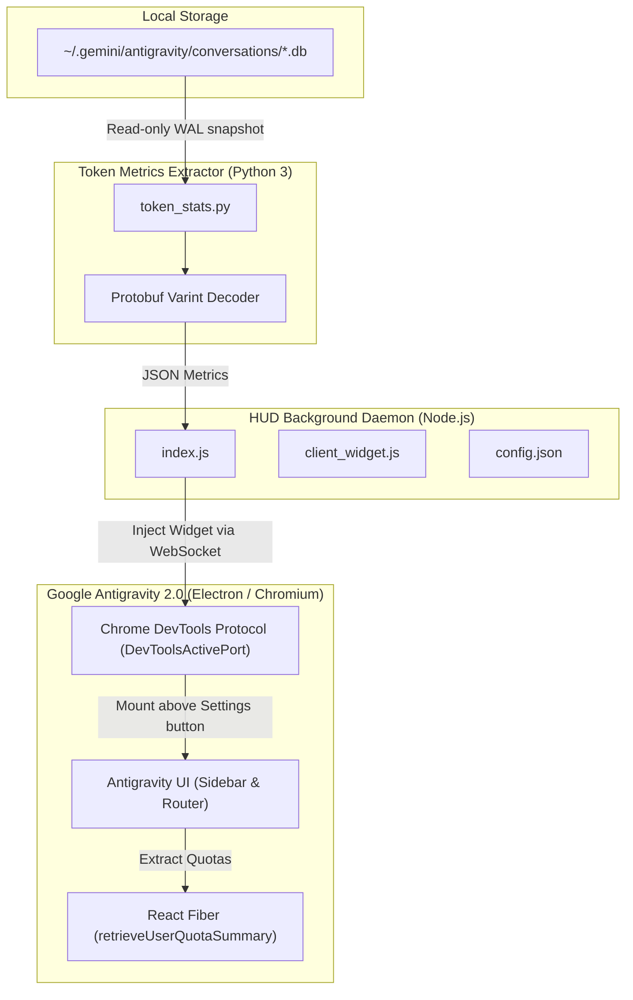

# agy-token-hud

> **Real-time token & quota usage HUD for Google Antigravity 2.0**  
> 适用于 Google Antigravity 2.0 的实时 Token 消耗与额度监控 HUD 仪表盘

[](LICENSE)
[](#)
[](#)

---

## 📖 简介 / Introduction

**agy-token-hud** 是一款专为 **Google Antigravity 2.0** 打造的轻量级、无侵入式 Token 与配额实时监控 HUD（Heads-Up Display）。

在日常使用 Antigravity 进行长对话或高频工程开发时，开发者往往难以直观掌握当前会话的上下文 Token 占用、模型缓存命中、思考 Token 消耗以及剩余的 5 小时与每周配额。**agy-token-hud** 通过 Chrome DevTools Protocol (CDP) 动态挂载到 Antigravity 侧边栏底部，无需破解或修改软件本体，即可实时呈现精准的消耗指标。

---

## ✨ 核心特性 / Key Features

- 🚀 **完全无侵入注入 (Zero-Intrusion CDP Injection)**  
  通过 Antigravity 的 `DevToolsActivePort` 端口直接连接，采用 WebSocket + CDP 动态挂载前端组件，不修改客户端二进制或核心源码文件，不影响客户端自动更新。
- 📊 **毫秒级精确 Token 解析 (Exact Token Accounting)**  
  直接从本地 SQLite 会话数据库（`gen_metadata` 与 `steps` 表）提取 Protobuf 结构，解码实时 Varint 标签。精准区分并呈现：**缓存 (Cache)**、**输入 (Prompt)**、**思考 (Thinking)**、**输出 (Output)** 四项指标。
- ⏱ **官方配额与重置倒计时 (Live Quotas & Reset Countdown)**  
  实时获取 Antigravity 内置 RPC（`retrieveUserQuotaSummary`）返回的配额状态，清晰呈现 **5小时滚动配额** 与 **每周配额** 的百分比以及下一次重置倒计时（例如 `1h25m`、`4d12h`）。
- 🎨 **原生 2.0 极简交互设计 (Pixel-Perfect Antigravity 2.0 Aesthetics)**  
  - **极致空间压缩**：折叠态仅高约 **25px**，展开态仅高约 **72px**，紧凑贴合侧边栏左下角（设置按钮上方），不遮挡会话历史列表。
  - **动态主题适配**：自适应亮色（Light）与暗色（Dark）模式，配备毛玻璃微光背景（`backdrop-filter: blur(12px)`）与平滑进度条过渡。
  - **一键伸缩**：点击卡片任意区域即可无缝在“极简折叠态”与“详细展开态”之间切换，状态自动保存在 `localStorage`。
- 💻 **跨平台与 WSL 混合环境原生支持 (Cross-Platform & WSL Ready)**  
  原生支持 Windows、WSL（Windows Subsystem for Linux）、macOS 以及 Linux。在 WSL 环境中运行时，能自动穿透并识别 Windows 主机端的 Antigravity 调试端口与会话数据库。

---

## 🖥 界面预览 / UI Layout

### 1. 紧凑折叠态 (Collapsed View, ~25px)
适合日常专注编码，以极简单行呈现关键上下文健康度与配额：
```text
┌──────────────────────────────────────────────────────────┐
│  🟢 上下文 2.7%                     5h:100%   周:100%  ▼ │
└──────────────────────────────────────────────────────────┘
```

### 2. 完整展开态 (Expanded View, ~72px)
点击卡片即可展开完整仪表盘，查看详细 Token 分布与配额重置倒计时：
```text
┌──────────────────────────────────────────────────────────┐
│  🟢 上下文 2.7% (27k/1M)                        [收起 ▲] │
│  ██████▒▒▒▒▒▒▒▒▒▒▒▒▒▒▒▒▒▒▒▒▒▒▒▒▒▒▒▒▒▒▒▒▒▒▒▒▒▒▒▒▒▒▒▒▒▒▒▒ │
│  缓存 20k       输入 7k        思考 122        输出 62   │
│                                                          │
│  5h配额 100%                 周配额 100% (4d12h)         │
│  ████████████████████        ████████████████████        │
└──────────────────────────────────────────────────────────┘
```

> **状态指示灯说明**：
> - 🟢 **绿色**：上下文占用 < 75%，配额充足。
> - 🟡 **黄色**：上下文占用 ≥ 75% 或 5h 配额剩余 ≤ 25%。
> - 🔴 **红色**：上下文占用 ≥ 90% 或 5h 配额剩余 ≤ 10%，建议开启新会话。

---

## 🏗 技术架构 / Architecture



---

## 🚀 快速上手 / Quick Start

### 前置条件 / Prerequisites
- 已安装 **Node.js** (v18+ 或 v20+)
- 已安装 **Python 3** (3.8+)
- 运行中的 **Google Antigravity 2.0**

---

### Windows (一键安装 & 开机自启)

推荐使用内置的 PowerShell 安装脚本：

1. 克隆代码仓库：
   ```powershell
   git clone https://github.com/DOXX-A/agy-token-hud.git
   cd agy-token-hud
   ```

2. 运行一键安装脚本：
   ```powershell
   powershell -ExecutionPolicy Bypass -File .\install.ps1
   ```
   > 该脚本会自动将文件部署至 `~/.antigravity-tokens-hud`，在 Windows 启动项目录生成快捷自启项，并立即静默启动后台监控进程。

---

### Linux / WSL / macOS (手动启动或守护进程)

1. 克隆并进入目录：
   ```bash
   git clone https://github.com/DOXX-A/agy-token-hud.git
   cd agy-token-hud
   ```

2. 直接前台运行：
   ```bash
   npm start
   # 或
   node index.js
   ```

3. （可选）使用 PM2 后台常驻：
   ```bash
   npm install -g pm2
   pm2 start index.js --name agy-token-hud
   pm2 save
   ```

---

## ⚙️ 配置文件 / Configuration

项目的 `config.json` 支持自定义选项：

```json
{
  "lang": "zh"
}
```

- `"lang"`: 界面语言偏好设置（`"zh"` 为中文，`"en"` 为英文）。

---

## 🗑 卸载 / Uninstallation

### Windows
运行仓库内或已安装目录中的卸载脚本：
```powershell
powershell -ExecutionPolicy Bypass -File .\uninstall.ps1
```
脚本将自动：
1. 终止正在运行的 `antigravity-tokens-hud` 后台进程。
2. 移除 Windows 开机自启项目。
3. 清理安装目录（`$env:USERPROFILE\.antigravity-tokens-hud`）。

---

## ❓ 常见问题 / FAQ

#### Q: 启动后在 Antigravity 侧边栏没有看到 HUD？
1. 请确认 Google Antigravity 2.0 处于开启状态。
2. 检查 DevToolsActivePort 文件是否存在：
   - Windows: `%APPDATA%\Antigravity\DevToolsActivePort`
   - macOS: `~/Library/Application Support/Antigravity/DevToolsActivePort`
   - Linux: `~/.config/Antigravity/DevToolsActivePort`
3. 确保你的环境中可以通过命令行运行 `python` 或 `python3`。

#### Q: 该工具会影响 Antigravity 的运行性能吗？
不会。HUD 后台守护进程以低开销轮询检查，读取数据库时采用只读副本模式（`sqlite3.connect(..., uri=True, mode=ro)`），不会占用数据库锁或阻塞 Antigravity 的读写操作；前端注入脚本亦在空闲帧渲染。

#### Q: 配额数据是从哪里获取的？
配额数据并非估算值，而是通过客户端内部的 RPC 状态（`retrieveUserQuotaSummary`）直接读取官方后端返回的精确剩余比例与重置时间戳。

---

## 📄 开源许可证 / License

本项目遵循 [MIT License](LICENSE) 开源许可证。
