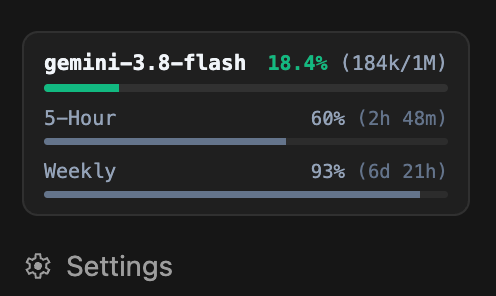
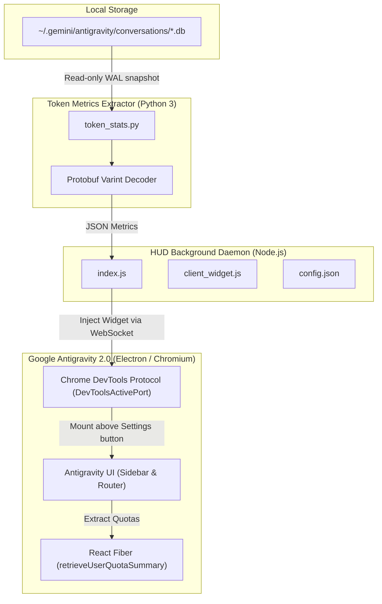

# agy-token-hud

> **Real-time token & quota usage HUD for Google Antigravity 2.0**  
> 适用于 Google Antigravity 2.0 的实时 Token 消耗与额度监控 HUD 仪表盘

[](LICENSE)
[](#)
[](#)
[](https://github.com/myslithell/antigravity-tokens-hud)

---

## 📌 致谢与上游声明 / Upstream Attribution

本项目基于 **[@myslithell](https://github.com/myslithell)** 的开源项目 **[myslithell/antigravity-tokens-hud](https://github.com/myslithell/antigravity-tokens-hud)** 进行深度定制与体验重构。  
感谢原作者优秀的创意、CDP（Chrome DevTools Protocol）无侵入注入机制以及 SQLite 数据提取方案！

---

## 🌟 相比原版的深度重构与改进 / Major Improvements Over Upstream

| 体验维度 | 原版 (myslithell/antigravity-tokens-hud) | 本重构版 (DOXX-A/agy-token-hud) |
| :--- | :--- | :--- |
| **空间占用** | 固定高度 ~160px，占据侧边栏大量纵向空间 | **双模态极致压缩**：折叠态仅 **25px**，展开态仅 **~72px**，释放超 55% 侧边栏可视空间 |
| **卡片交互** | 点击卡片切换俄语/英语 (RU/EN) | **点击一键伸缩**（展开/收起切换），状态通过 `localStorage` 自动记忆 |
| **Token 明细** | 仅展示总 Context 上下文体积及占比 | **四维度颗粒度拆解**：缓存 (Cache)、输入 (Prompt)、思考 (Thinking)、输出 (Output) |
| **进度条设计** | 纯色彩条填充，无底槽对比 | **双色阶自适应底槽轨道**，亮色/暗色主题下均可清晰洞察真实占比与余量 |
| **配额布局** | 5h 配额与周配额上下多行纵向堆叠 | **并排双列紧凑布局**，实时显示剩余百分比与精准重置倒计时（如 `1h25m`、`4d12h`） |
| **视觉与排版** | 包含冗余模型名称，存在留白与遮罩 | 去除模型名占位，状态灯融合首行，消除顶部留白并紧凑对齐侧边栏底栏 |
| **本地化** | 俄文与英文为主 | **中文原生全字标签**，字体清晰规整，自适应深色/浅色模式 |
| **环境兼容** | 仅面向单机本地路径 | **WSL 与 Windows 跨环境双向自适应**，自动穿透宿主机调试端口与跨系统数据库 |

---

## 📖 简介 / Introduction

**agy-token-hud** 是一款专为 **Google Antigravity 2.0** 打造的轻量级、无侵入式 Token 与配额实时监控 HUD（Heads-Up Display）。

在日常使用 Antigravity 进行长对话或高频工程开发时，开发者往往难以直观掌握当前会话的上下文 Token 占用、模型缓存命中、思考 Token 消耗以及剩余的 5 小时与每周配额。**agy-token-hud** 通过 Chrome DevTools Protocol (CDP) 动态挂载到 Antigravity 侧边栏底部，无需破解或修改软件本体，即可实时呈现精准的消耗指标。

---

## 🖥 界面预览 / UI Layout

<p align="center">
  
</p>

### 1. 紧凑折叠态 (Collapsed View, ~25px)
适合日常专注编码，以极简单行呈现关键上下文健康度与配额：
```text
┌──────────────────────────────────────────────────────────┐
│  🟢 上下文 2.7%                     5h:100%   周:100%  ▼ │
└──────────────────────────────────────────────────────────┘
```

### 2. 完整展开态 (Expanded View, ~72px)
点击卡片即可展开完整仪表盘，查看详细 Token 分布与配额重置倒计时：
```text
┌──────────────────────────────────────────────────────────┐
│  🟢 上下文 2.7% (27k/1M)                        [收起 ▲] │
│  ██████▒▒▒▒▒▒▒▒▒▒▒▒▒▒▒▒▒▒▒▒▒▒▒▒▒▒▒▒▒▒▒▒▒▒▒▒▒▒▒▒▒▒▒▒▒▒▒▒ │
│  缓存 20k       输入 7k        思考 122        输出 62   │
│                                                          │
│  5h配额 100%                 周配额 100% (4d12h)         │
│  ████████████████████        ████████████████████        │
└──────────────────────────────────────────────────────────┘
```

> **状态指示灯说明**：
> - 🟢 **绿色**：上下文占用 < 75%，配额充足。
> - 🟡 **黄色**：上下文占用 ≥ 75% 或 5h 配额剩余 ≤ 25%。
> - 🔴 **红色**：上下文占用 ≥ 90% 或 5h 配额剩余 ≤ 10%，建议开启新会话。

---

## 🏗 技术架构 / Architecture



---

## 🚀 快速上手 / Quick Start

### 前置条件 / Prerequisites
- 已安装 **Node.js** (v18+)
- 已安装 **Python 3** (3.8+)
- 运行中的 **Google Antigravity 2.0**

---

### Windows (一键在线安装 / 本地安装)

#### 方式 A：PowerShell 一键命令
```powershell
irm https://raw.githubusercontent.com/DOXX-A/agy-token-hud/master/install.ps1 | iex
```

#### 方式 B：克隆仓库安装
```powershell
git clone https://github.com/DOXX-A/agy-token-hud.git
cd agy-token-hud
powershell -ExecutionPolicy Bypass -File .\install.ps1
```
> 安装脚本会自动检测/配置依赖，将文件部署至 `$env:USERPROFILE\.antigravity-tokens-hud`，在 Windows 启动项目录生成快捷自启项，并立即静默启动后台监控守护进程。

---

### Linux / macOS / WSL

#### 方式 A：终端一键命令
```bash
curl -fsSL https://raw.githubusercontent.com/DOXX-A/agy-token-hud/master/install.sh | bash
```

#### 方式 B：手动运行
```bash
git clone https://github.com/DOXX-A/agy-token-hud.git
cd agy-token-hud
npm start
# 或使用后台守护进程
nohup node index.js > /dev/null 2>&1 &
```

---

## ⚙️ 配置文件 / Configuration

项目的 `config.json` 支持自定义选项：

```json
{
  "lang": "zh"
}
```

- `"lang"`: 界面语言偏好设置（`"zh"` 为中文，`"en"` 为英文）。

---

## 🗑 卸载 / Uninstallation

### Windows
运行卸载脚本即可彻底清理后台进程、启动项与安装目录：
```powershell
powershell -ExecutionPolicy Bypass -File "$env:USERPROFILE\.antigravity-tokens-hud\uninstall.ps1"
```

### Linux / macOS
```bash
~/.antigravity-tokens-hud/uninstall.sh
```

---

## ❓ 常见问题 / FAQ

#### Q: 启动后在 Antigravity 侧边栏没有看到 HUD？
1. 请确认 Google Antigravity 2.0 处于开启状态。
2. 检查 DevToolsActivePort 文件是否存在：
   - Windows: `%APPDATA%\Antigravity\DevToolsActivePort`
   - macOS: `~/Library/Application Support/Antigravity/DevToolsActivePort`
   - Linux: `~/.config/Antigravity/DevToolsActivePort`
3. 确保你的环境中可以通过命令行运行 `python` 或 `python3`。

#### Q: 该工具会影响 Antigravity 的运行性能吗？
不会。HUD 后台守护进程以低开销轮询检查，读取数据库时采用只读副本模式（`sqlite3.connect(..., uri=True, mode=ro)`），不会占用数据库锁或阻塞 Antigravity 的读写操作；前端注入脚本亦在空闲帧渲染。

#### Q: 配额数据是从哪里获取的？
配额数据并非估算值，而是通过客户端内部的 RPC 状态（`retrieveUserQuotaSummary`）直接读取官方后端返回的精确剩余比例与重置时间戳。

---

## 📄 开源许可证 / License

本项目遵循 [MIT License](LICENSE) 开源许可证。  
原版版权属于 [myslithell](https://github.com/myslithell/antigravity-tokens-hud)，重构与增强版版权属于 [DOXX-A](https://github.com/DOXX-A/agy-token-hud)。
